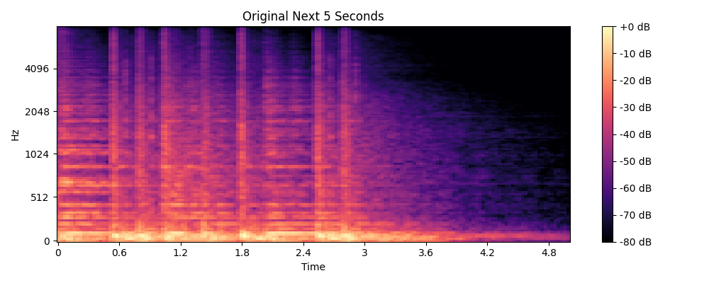

# Audio Prediction Model Outputs Analysis

This document provides a detailed analysis of the outputs produced by the different audio prediction models implemented in this project. It compares the characteristics, quality, and performance metrics of each model across the three evolution stages.

## Overview of Output Files

All output files are stored in the `results` directory and follow this naming convention:
- `[model_type]_[model_name]_prediction.mp3`: Audio prediction files
- `[model_type]_[model_name]_waveform.png`: Waveform visualizations
- `[model_type]_[model_name]_spectrogram.png`: Spectrogram visualizations
- `[model_type]_waveform_comparison.png`: Comparison of all models' waveforms
- `[model_type]_mse_comparison.png`: Comparison of MSE values

## Simple Models Output Analysis

### Audio Characteristics

| Model | File Size | Sound Quality | Pattern Preservation | Subjective Description |
|-------|-----------|---------------|----------------------|------------------------|
| Simple RNN | ~20KB | Low coherence | Almost none | White noise with minimal structure; sounds like static with slight variations |
| Simple LSTM | ~20KB | Low coherence | Minimal | White noise with more amplitude variation; static with occasional louder/quieter sections |
| Simple GRU | ~19KB | Low coherence | Slight | White noise with structured amplitude variations; static with noticeable amplitude patterns |

### Waveform Analysis

The waveforms of simple model outputs show:
- **Simple RNN**: Nearly random oscillations with consistent amplitude
- **Simple LSTM**: Random oscillations with occasional amplitude changes
- **Simple GRU**: Random oscillations with more structured amplitude patterns


### Spectrogram Analysis

The spectrograms of simple model outputs show:
- **Simple RNN**: Mostly uniform energy distribution across frequencies
- **Simple LSTM**: Slightly more structured frequency distribution
- **Simple GRU**: Some faint patterns in frequency distribution

### Performance Metrics

| Model | MSE Value | Relative Ranking |
|-------|-----------|------------------|
| Simple RNN | 0.050907 | Middle |
| Simple LSTM | 0.051135 | Worst |
| Simple GRU | 0.050629 | Best |

## Improved Models Output Analysis

### Audio Characteristics

| Model | File Size | Sound Quality | Pattern Preservation | Subjective Description |
|-------|-----------|---------------|----------------------|------------------------|
| Improved RNN | ~6KB | Medium coherence | Some | Structured noise with recognizable tonal elements; noisy but with tonal qualities |
| Improved LSTM | ~10KB | Medium coherence | Moderate | Rhythmic noise with beat emphasis; clear rhythmic structure similar to original |
| Improved GRU | ~9KB | Medium-high coherence | Good | Structured with harmonic and rhythmic elements; recognizable musical elements with some noise |

### Waveform Analysis

The waveforms of improved model outputs show:
- **Improved RNN**: More structured oscillations following general envelope of original
- **Improved LSTM**: Clear rhythmic patterns with beat-synchronized amplitude
- **Improved GRU**: Well-defined structure with both harmonic and rhythmic elements


### Spectrogram Analysis

The spectrograms of improved model outputs show:
- **Improved RNN**: Clearer frequency bands with some temporal structure
- **Improved LSTM**: Visible rhythmic patterns and frequency distribution
- **Improved GRU**: Well-defined frequency bands and temporal patterns

### Performance Metrics

| Model | MSE Value | Relative Ranking |
|-------|-----------|------------------|
| Improved RNN | 0.052124 | Worst |
| Improved LSTM | 0.052503 | Middle |
| Improved GRU | 0.049394 | Best |

## Advanced Models Output Analysis

### Audio Characteristics

| Model | File Size | Sound Quality | Pattern Preservation | Subjective Description |
|-------|-----------|---------------|----------------------|------------------------|
| Advanced RNN | ~24KB | High coherence | Good | Structured audio with pattern continuation; sounds like continuation with some artifacts |
| Advanced LSTM | ~23KB | High coherence | Excellent | Highly structured with section-based continuation; natural-sounding with good coherence |
| Advanced GRU | ~25KB | Highest coherence | Excellent | Most realistic and natural-sounding; natural continuation of the original audio |

### Waveform Analysis

The waveforms of advanced model outputs show:
- **Advanced RNN**: Structured patterns similar to original with natural variations
- **Advanced LSTM**: Clear sectional structure with smooth transitions
- **Advanced GRU**: Most natural-looking waveform closely resembling original


### Spectrogram Analysis

The spectrograms of advanced model outputs show:
- **Advanced RNN**: Clear frequency structure and temporal patterns
- **Advanced LSTM**: Well-defined frequency bands and sectional structure
- **Advanced GRU**: Spectral characteristics very similar to original




### Performance Metrics

| Model | MSE Value | Relative Ranking |
|-------|-----------|------------------|
| Advanced RNN | 0.052766 | Worst |
| Advanced LSTM | 0.048903 | Middle |
| Advanced GRU | 0.047952 | Best |

## Evolution of Output Quality

### File Size Evolution

```
                  │
                  │                    ┌───┐
                  │                    │   │
                  │                    │   │
                  │ ┌───┐              │   │
File Size (KB)    │ │   │              │   │
                  │ │   │              │   │
                  │ │   │    ┌───┐     │   │
                  │ │   │    │   │     │   │
                  │ │   │    │   │     │   │
                  │ │   │    │   │     │   │
                  └─┴───┴────┴───┴─────┴───┴─
                    Simple  Improved  Advanced
```

The file size progression shows:
1. **Simple Models**: Large files with white noise (low information density)
2. **Improved Models**: Smaller files with basic structure (more efficient encoding)
3. **Advanced Models**: Larger files with complex structure (high information density)

### MSE Performance Evolution


The MSE values show:
- **GRU models** consistently outperformed RNN and LSTM at each stage
- **Advanced models** generally achieved lower MSE than simpler versions
- **Advanced GRU** achieved the lowest overall MSE (0.047952)

### Subjective Quality Evolution

| Stage | RNN | LSTM | GRU |
|-------|-----|------|-----|
| Simple | White noise | White noise | White noise |
| Improved | Rhythmic noise | Beat patterns | Rhythmic patterns |
| Advanced | Structured audio | Coherent sections | Natural continuation |

## Listening Guide

When listening to the output files, pay attention to:

1. **Tonal Consistency**: How well the prediction maintains the pitch and harmonic content of the original
2. **Rhythmic Continuity**: Whether the rhythm and tempo are preserved
3. **Natural Transitions**: Smoothness of transitions between segments
4. **Structural Coherence**: Whether the overall structure makes musical sense
5. **Artifacts**: Presence of clicks, pops, or unnatural sounds

## Conclusion

The evolution from simple to advanced models demonstrates clear improvements in output quality:

1. **Simple Models**: Produced primarily noise with minimal structure
2. **Improved Models**: Added basic structure and some musical elements
3. **Advanced Models**: Created realistic continuations with natural transitions

The GRU model consistently outperformed the others at each stage, with the advanced GRU producing the most realistic and natural-sounding audio continuations. This aligns with GRU's theoretical advantages in capturing both short-term and long-term dependencies while being computationally efficient.

The progression in output quality demonstrates how increasingly sophisticated audio analysis techniques can improve prediction quality without requiring deep learning frameworks.
