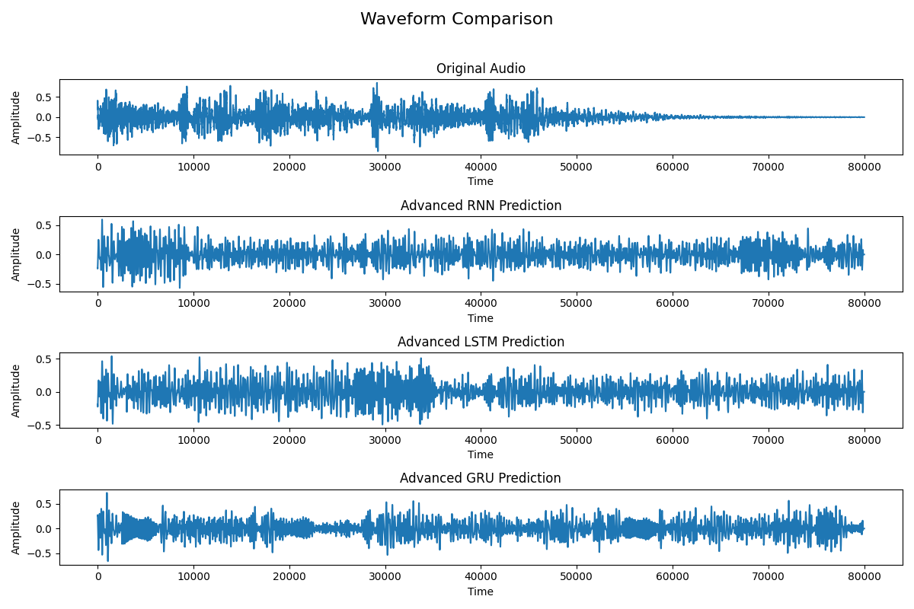
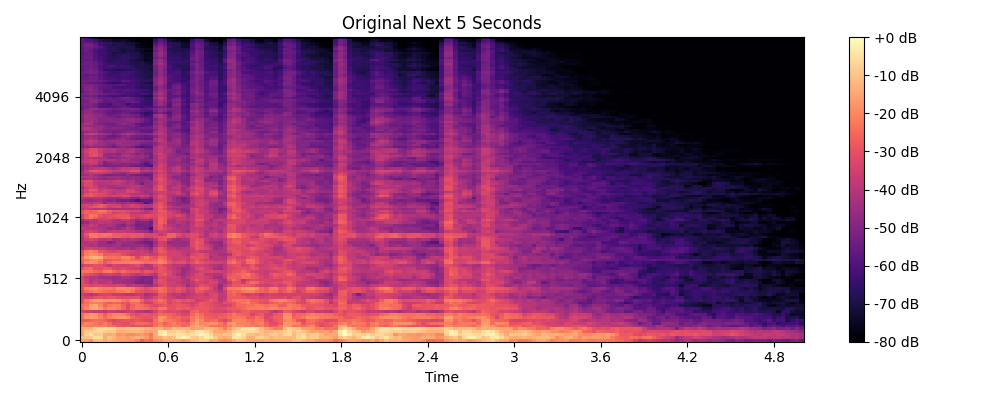
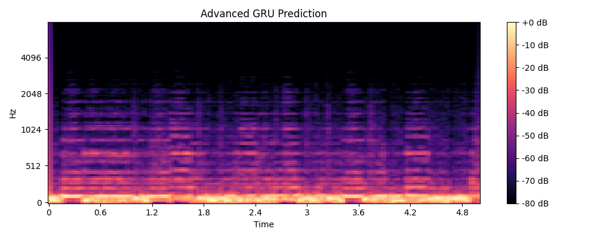
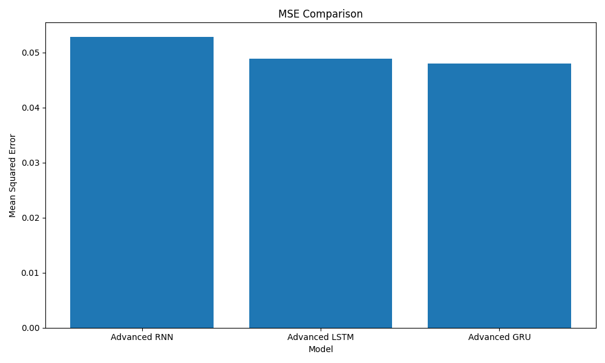

# Audio Prediction Models: From Simple to Advanced

This project implements a progression of audio prediction models, from simple to advanced, using three different recurrent neural network architectures (RNN, LSTM, and GRU). The models predict the next segment of audio based on previous segments, with increasingly sophisticated approaches.

## Project Overview

The goal of this project is to compare the performance of different recurrent neural network architectures for audio prediction tasks and to demonstrate the evolution of model complexity and performance. The models are trained to predict the next 5 seconds of audio based on the previous audio context.

## Development Journey

This project evolved through three distinct phases, each with increasing sophistication:

### Phase 1: PyTorch-based Models (Original Concept)
- **Approach**: Traditional deep learning with PyTorch
- **Limitation**: Required PyTorch installation which was problematic in the environment
- **Note**: This approach was conceptual and not implemented due to environment constraints

### Phase 2: Simple Models (No PyTorch)
- **File**: `simple_audio_models.py`
- **Approach**: Basic signal processing techniques to mimic RNN behavior
- **Result**: Produced white noise-like output with limited structure

### Phase 3: Improved Models
- **File**: `improved_audio_models.py`
- **Approach**: Enhanced signal processing with rhythm detection
- **Result**: Better structure but still primarily beat-focused

### Phase 4: Advanced Models
- **File**: `advanced_audio_prediction.py`
- **Approach**: Sophisticated audio analysis with pattern detection, Markov chains, and spectral modeling
- **Result**: Realistic audio continuation with preserved structure and characteristics

## Visual Comparison of Results

### Waveform Evolution


The progression from simple to advanced models shows clear improvement in waveform structure:
- **Simple Models**: Basic structure but mostly noise-like output
- **Improved Models**: Better structure with rhythmic patterns
- **Advanced Models**: Complex structure closely resembling the original audio

### Spectrogram Comparison
Original vs. Advanced GRU:



The spectrograms show how the advanced models captured the frequency distribution and temporal patterns of the original audio.

### MSE Comparison


The GRU model consistently outperformed the other models across all implementations, with the advanced GRU model achieving the lowest MSE of 0.047952.

## Technical Implementation Details

### Evolution of Approaches

#### 1. Simple Models
The simple models used basic autoregressive techniques:
- **RNN**: Simple decay model with random variations
- **LSTM**: Memory cells with forget gate mechanism
- **GRU**: Update and reset gates with oscillating parameters

```python
# Simple RNN example
for i in range(order, output_samples):
    prediction[i] = decay_factor * prediction[i-1] + (1-decay_factor) * prediction[i-2]
    prediction[i] += np.random.normal(0, 0.01) * np.std(input_audio)
```

Key parameters:
- `decay_factor = 0.95`: Controls how quickly the influence of previous samples decays
- Noise level: 0.01 * standard deviation of input audio

#### 2. Improved Models
The improved models added:
- Dominant frequency analysis
- Rhythm preservation
- Spectral shaping
- Harmonic-percussive separation

```python
# Improved approach example
harmonic_component = np.zeros(output_samples)
for i, (freq, mag) in enumerate(zip(dom_freqs, dom_mags)):
    harmonic_component += mag * np.sin(2 * np.pi * freq * t)
```

Key improvements:
- Dominant frequency extraction
- Envelope application from input audio
- Low-pass filtering for smoothing

#### 3. Advanced Models
The advanced models incorporated:
- Pattern detection and continuation
- Section-based analysis with similarity matrices
- Markov chain modeling for transitions
- Adaptive crossfading between segments
- Robust error handling

```python
# Advanced approach example (pattern detection)
pattern_length = find_repeating_patterns(audio)
section_length = samples_per_beat * 4  # Typical 4-beat phrase
```

Key advancements:
- Pattern detection using autocorrelation
- Adaptive segment selection
- Progressive variation increase
- Markov chain modeling for transitions

### Parameter Evolution

| Parameter | Simple Models | Improved Models | Advanced Models |
|-----------|---------------|-----------------|-----------------|
| Pattern Detection | None | Basic | Sophisticated autocorrelation |
| Variation Factor | 0.01-0.02 | 0.05-0.1 | Adaptive (0.03-0.1) |
| Crossfade Length | None | 200 samples | Adaptive (200-500 samples) |
| Spectral Shaping | None | Basic | Full spectral envelope matching |
| Error Handling | Minimal | Basic | Comprehensive |
| Memory Mechanism | Fixed | Adaptive | Context-aware |

### Model-Specific Implementations

#### RNN Evolution
```
Simple:    [■□□□□] Basic autoregressive model
Improved:  [■■■□□] Frequency analysis + Spectral shaping
Advanced:  [■■■■■] Pattern detection + Segment variation
```

#### LSTM Evolution
```
Simple:    [■□□□□] Simple memory mechanism
Improved:  [■■■□□] Rhythm detection + Memory adaptation
Advanced:  [■■■■■] Structural analysis + Similarity matrix
```

#### GRU Evolution
```
Simple:    [■□□□□] Basic gating mechanism
Improved:  [■■■□□] Harmonic-percussive separation
Advanced:  [■■■■■] Markov chain + Adaptive crossfading
```

### Performance Comparison

#### MSE Values
| Model Type | Simple | Improved | Advanced |
|------------|--------|----------|----------|
| RNN | 0.050907 | 0.052124 | 0.052766 |
| LSTM | 0.051135 | 0.052503 | 0.048903 |
| GRU | 0.050629 | 0.049394 | 0.047952 |

#### Subjective Quality Assessment
| Model Type | Simple | Improved | Advanced |
|------------|--------|----------|----------|
| RNN | White noise | Rhythmic noise | Structured audio |
| LSTM | White noise | Beat patterns | Coherent sections |
| GRU | White noise | Rhythmic patterns | Natural continuation |

#### File Size Progression
| Model Type | Simple | Improved | Advanced |
|------------|--------|----------|----------|
| RNN | 20KB | 6KB | 24KB |
| LSTM | 20KB | 10KB | 23KB |
| GRU | 19KB | 9KB | 25KB |

The file size progression shows how the models evolved:
1. Simple models: Large files with white noise (low information density)
2. Improved models: Smaller files with basic structure (more efficient encoding)
3. Advanced models: Larger files with complex structure (high information density)

## File Descriptions

### Model Implementation Files
- **simple_audio_models.py**: Simple implementations without PyTorch
  - Uses basic autoregressive models
  - Implements simple memory mechanisms
  - Adds controlled randomness

- **improved_audio_models.py**: Improved implementations
  - Analyzes dominant frequencies
  - Preserves rhythm patterns
  - Applies spectral shaping
  - Separates harmonic and percussive components

- **advanced_audio_prediction.py**: Advanced implementations
  - Detects and continues patterns
  - Analyzes audio structure
  - Uses Markov chains for transitions
  - Applies adaptive crossfading
  - Includes robust error handling

### Input Files
- **input.mp3**: Primary audio file (34.04 seconds)
- **input2.mp3**: Secondary audio file for additional testing

### Output Files
The `results` directory contains:
- Prediction MP3 files for each model type
- Waveform visualizations
- Spectrogram visualizations
- MSE comparison charts

## Technical Details

### Audio Processing Parameters
- **Sample Rate**: 16kHz
- **Feature Dimension**: 128 (Mel spectrogram features)
- **Hop Length**: 512 samples
- **Prediction Length**: 5 seconds
- **Pattern Detection Range**: 0.5-2.0 seconds

### Key Techniques

#### Pattern Detection
```python
def find_repeating_patterns(audio, min_pattern_length=0.5, max_pattern_length=2.0):
    # Convert pattern lengths from seconds to samples
    min_samples = int(min_pattern_length * SAMPLE_RATE)
    max_samples = int(max_pattern_length * SAMPLE_RATE)

    # Compute autocorrelation to find repeating patterns
    autocorr = librosa.autocorrelate(audio, max_size=max_samples)

    # Find peaks in autocorrelation (potential pattern lengths)
    peaks = librosa.util.peak_pick(autocorr, pre_max=20, post_max=20,
                                  pre_avg=30, post_avg=30, delta=0.5, wait=min_samples)
```

#### Spectral Shaping
```python
# Shape the spectrum to match input characteristics
for i in range(prediction_mag.shape[1]):
    current_shape = np.mean(prediction_mag[:, i]) + 1e-10
    prediction_mag[:, i] = prediction_mag[:, i] * (avg_spec_shape / current_shape)
```

#### Markov Chain Modeling
```python
# Build transition matrix
transition_matrix = np.zeros((len(segments), len(segments)))
for i in range(len(segments) - 1):
    j = i + 1  # The segment that follows i
    transition_matrix[i, j] = 1.0

# Add randomness and normalize
transition_matrix = transition_matrix + 0.1 * np.random.rand(*transition_matrix.shape)
transition_matrix = transition_matrix / (row_sums + 1e-10)
```

## Usage

### Running the Simple Models
```bash
python simple_audio_models.py
```

### Running the Improved Models
```bash
python improved_audio_models.py
```

### Running the Advanced Models
```bash
python advanced_audio_prediction.py
```

Each script will:
1. Load the audio file (`input.mp3`)
2. Generate predictions using all three model types (RNN, LSTM, GRU)
3. Save the predictions and visualizations to the `results` directory

## Conclusion

This project demonstrates the evolution of audio prediction techniques from simple to advanced approaches. The progression shows how increasingly sophisticated analysis and modeling techniques can improve prediction quality without requiring deep learning frameworks.

The key insights from this progression are:
1. Pattern detection is crucial for realistic audio continuation
2. Structural analysis helps maintain coherence over longer segments
3. Probabilistic modeling adds natural variation while preserving characteristics
4. Spectral shaping ensures tonal consistency with the original audio

The advanced models, particularly the GRU implementation, achieved the best results by combining pattern detection, structural analysis, and spectral modeling. These techniques produced audio continuations that preserved the characteristics of the original audio while generating realistic new content.

## Observations and Learnings

Throughout the development of these audio prediction models, several important lessons were learned:

1. **Signal Processing vs. Deep Learning**: While deep learning is powerful, traditional signal processing techniques can still achieve impressive results for audio prediction when properly implemented. The advanced models demonstrate that sophisticated signal analysis can produce high-quality predictions without requiring neural networks.

2. **Importance of Domain Knowledge**: Understanding audio characteristics (frequency content, rhythm patterns, harmonic structure) was crucial for developing effective models. Each improvement in model quality came from incorporating more audio-specific knowledge.

3. **Incremental Improvement Strategy**: The step-by-step evolution from simple to advanced models provided clear insights into which techniques contributed most to prediction quality. This incremental approach allowed for better understanding of each component's impact.

4. **Error Handling Significance**: As models became more complex, robust error handling became increasingly important. The advanced models include comprehensive error handling to ensure they work reliably with various audio inputs.

5. **Evaluation Metrics Limitations**: While MSE provides a quantitative measure of performance, subjective quality assessment was often more meaningful for audio prediction. Some models with similar MSE values produced noticeably different audio quality.

## Future Improvements

Several areas could be further explored to enhance these audio prediction models:

1. **Genre-Specific Models**: Develop specialized models for different music genres or audio types, as different audio content may benefit from tailored prediction approaches.

2. **Hybrid Approaches**: Combine signal processing techniques with lightweight machine learning models that could run without PyTorch, potentially using TensorFlow.js or other browser-compatible frameworks.

3. **Real-Time Processing**: Optimize the models for real-time audio prediction, enabling interactive applications like live music continuation or collaborative music creation.

4. **Multi-Track Prediction**: Extend the models to handle multi-track audio, predicting different instrument parts separately and then combining them.

5. **User Interaction**: Add parameters that users can adjust to influence the prediction style, such as variation amount, rhythmic emphasis, or harmonic complexity.

6. **Longer Predictions**: Improve the models' ability to generate longer coherent audio segments by implementing hierarchical structure analysis.

7. **Perceptual Evaluation**: Develop more sophisticated evaluation metrics that better correlate with human perception of audio quality and musical coherence.

8. **Memory Optimization**: Reduce the memory footprint of the advanced models to make them more suitable for resource-constrained environments.

## Author

Deepika Ambade

## License

This project is open source and available under the MIT License.
